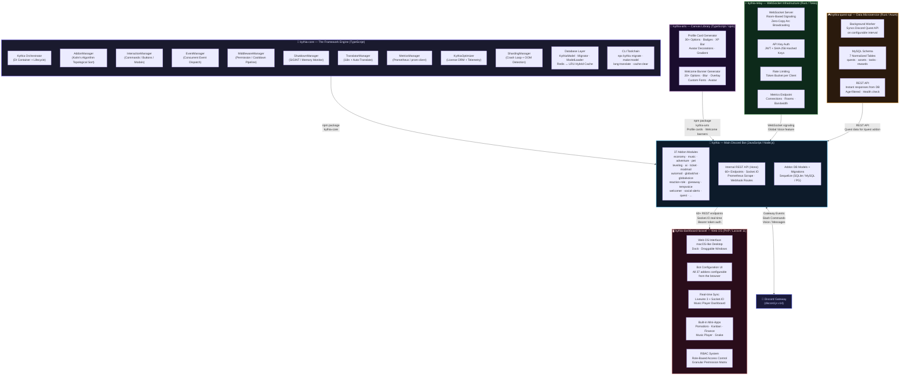
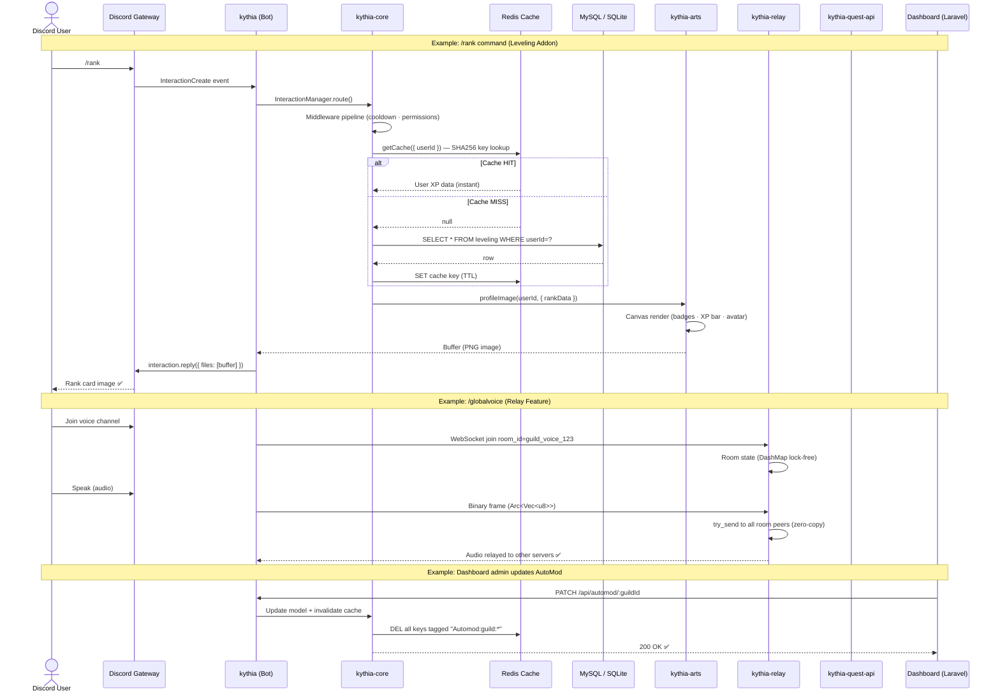
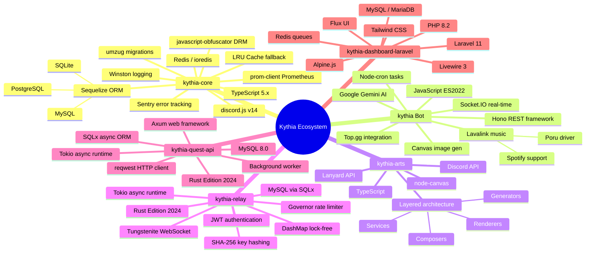
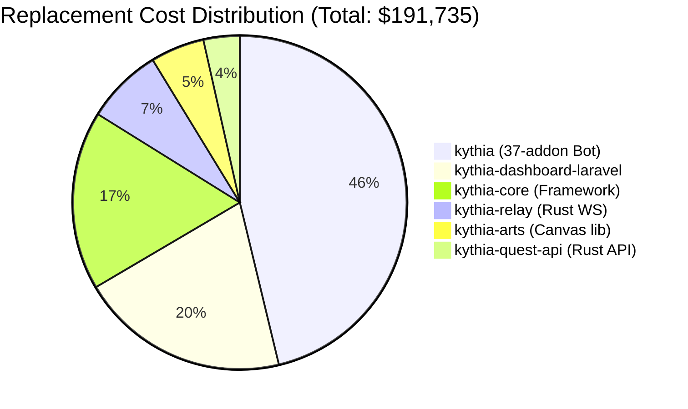
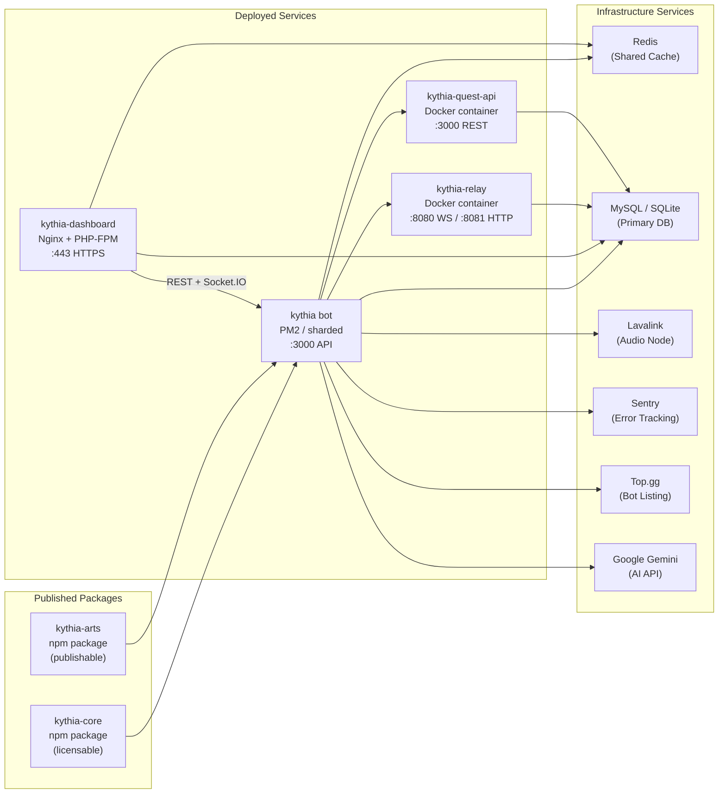

# Kythia Ecosystem — Investment & Acquisition Brief

> **Prepared for:** Investors & Strategic Buyers  
> **Prepared by:** kenndeclouv (Kythia Labs)  
> **Date:** April 2026  
> **Valuation Method:** Replacement Cost + Market Comparable Hybrid  
> **Classification:** Confidential

---

## Executive Summary

The **Kythia Ecosystem** is a vertically integrated, production-ready Discord bot platform spanning six distinct software projects across three programming languages (JavaScript/TypeScript, PHP, Rust). It is not a single product — it is a **full software company in code form**: a framework, a feature-rich bot, a custom rendering library, a real-time infrastructure layer, a specialized API service, and a web management suite.

What makes Kythia exceptional is the **architectural coherence** between all components. Every layer was designed to interlock: the bot consumes the framework, the framework powers the API, the dashboard consumes the API, the relay serves the voice features, and the quest API feeds the gamification layer. This is not a collection of loosely related scripts — it is a **platform**.

**Total Estimated Valuation: $38,000 – $58,000 USD**

---

## Ecosystem Architecture Visualization

### 🗺️ High-Level Ecosystem Map



---

### 🔄 Data Flow: Request Lifecycle



---

### 🏗️ Technology Stack Map



---

### 💰 Valuation Breakdown Visual



---

### 🔗 Dependency & Integration Web



---

## Valuation Methodology

Two complementary approaches are used and averaged:

**1. Replacement Cost** — What would it cost to rebuild this from scratch, hiring professional developers at market rates?

- Senior Node.js/TypeScript Developer: **$65–85/hr**
- Senior Rust Developer: **$80–100/hr**
- Senior Laravel/PHP Developer: **$55–70/hr**
- Senior UI/UX + Frontend Developer: **$60–75/hr**
- DevOps / Architecture: **$70–90/hr**

**2. Market Comparable** — What do similar Discord bot platforms, SaaS frameworks, or community tools sell for on the open market?

- Comparable Discord bots with 10+ features: $3,000–$8,000
- Bot frameworks with documentation: $5,000–$15,000
- Full SaaS platforms with dashboard + API: $20,000–$60,000+
- Infrastructure layers (WebSocket servers in Rust): $8,000–$20,000

---

## Project-by-Project Breakdown

---

### 1. `kythia-core` — The Framework Engine

**Language:** TypeScript | **Version:** `1.0.0-rc.3` | **Size:** ~17,349 lines of source TS

#### What It Is

`kythia-core` is an enterprise-grade Discord bot framework built on top of discord.js v14. It is not a bot — it is the **engine that runs the bot**. Think of it as the Laravel of Discord bot development: a full-stack opinionated framework with database abstraction, DI container, plugin system, CLI tools, and production observability baked in.

#### Technical Depth

The framework implements **9 distinct manager subsystems**, each with its own domain:

| Manager | Responsibility |
|---|---|
| `AddonManager` | Plugin discovery, dependency graph (Kahn's algorithm), topological sort |
| `InteractionManager` | Routes slash commands, buttons, modals, select menus with middleware pipeline |
| `EventManager` | Multi-handler concurrent event dispatch |
| `MiddlewareManager` | Command validation pipeline (permissions, cooldown, owner-only) |
| `ShutdownManager` | SIGINT/SIGTERM handling, interval tracking, memory pressure monitor |
| `TranslatorManager` | i18n with variable interpolation, per-addon locale loading |
| `MetricsManager` | Prometheus-compatible metrics via `prom-client` |
| `KythiaOptimizer` | License verification, HWID fingerprinting, heartbeat pulse, anti-tamper |
| `ShardingManager` | Crash loop detection, OOM kill detection, lifetime restart tracking |

The **database layer** (`KythiaModel`) implements a **hybrid Redis/LRU caching system** with tag-based cache invalidation — a pattern seen in enterprise ORMs, not hobbyist projects. SHA-256 cache key generation, afterSave/afterDestroy hooks for automatic invalidation, and transparent Redis-to-LRU fallback make this a production-grade abstraction.

The **migration system** is a full Laravel-style `umzug`-powered pipeline with batch tracking, rollback support, and addon-scoped migrations.

The **addon system** supports:
- Slash commands (with nested subcommand groups)
- Button, Modal, SelectMenu handlers
- Cron-based and interval-based task scheduler
- Per-addon database models, migrations, seeders
- Per-addon i18n locale files
- Dependency declaration and topological load ordering

The framework also ships with a full **CLI toolchain** (`npx kythia`):
- `migrate`, `migrate --fresh`, `migrate --rollback`
- `make:model`, `make:migration`, `make:addon`
- `lang:check`, `lang:translate` (auto-translation via Google API)
- `cache:clear`, `gen:structure`, `version:up`

#### Why It's Valuable

This is a **licensable, distributable npm package** (`kythia-core` on npm). A buyer gets not just source code but a **publishable, monetizable framework** they can sell licenses to, charge for support, or use as the foundation for their own bot platform. It already ships with code obfuscation configured (`javascript-obfuscator`), DRM/license verification built in, and a telemetry pipeline to the license server.

#### Replacement Cost Estimate

- Architecture design & DI system: 60 hrs × $80 = **$4,800**
- 9 manager subsystems: 180 hrs × $75 = **$13,500**
- Database layer (KythiaModel, KythiaMigrator, ModelLoader): 80 hrs × $80 = **$6,400**
- CLI toolchain (10+ commands): 60 hrs × $70 = **$4,200**
- TypeScript types & interfaces: 30 hrs × $65 = **$1,950**
- Tests & documentation (7 detailed doc files): 40 hrs × $60 = **$2,400**

**Subtotal: ~$33,250**

**Market-adjusted value: $8,000 – $14,000**

---

### 2. `kythia` — The Main Discord Bot

**Language:** JavaScript (Node.js) | **Version:** `1.0.0-rc` | **Size:** ~512,447 lines (including lang, migrations, all addon files)

#### What It Is

`kythia` is the production bot built on top of `kythia-core`. It is a **feature-complete, multi-server Discord bot** with 37 addon modules, 843 source files, and a changelog spanning from `v0.9.9-beta-rc.1` through `v1.0.0-rc` — representing approximately **18+ months of active development**.

#### The Addon Ecosystem (37 Modules)

| Category | Addons |
|---|---|
| Core & Moderation | `core`, `automod`, `verification`, `welcomer` |
| Engagement & Economy | `economy`, `adventure`, `pet`, `streak`, `leveling`, `activity` |
| Fun & Games | `fun`, `manga`, `birthday`, `checklist`, `giveaway` |
| Communication | `globalchat`, `globalvoice`, `modmail`, `ticket` |
| Server Utilities | `server`, `tempvoice`, `reaction-role`, `embed-builder`, `social-alerts` |
| Integrations | `ai` (Google Gemini), `music` (Lavalink + Spotify), `minecraft` |
| Platform | `license`, `pro`, `quest`, `api`, `booster`, `invite`, `autoreact`, `autoreply`, `image` |

Each addon ships with its own commands, events, database models, migrations, tasks, i18n files, and button/modal handlers — self-contained feature units.

#### Notable Technical Features

- **Components V2 architecture** — All UI built on Discord's newest message component system, future-proofed against legacy embed deprecation
- **Global Chat** — Cross-server webhook relay system with health check and auto-repair
- **Global Voice** (via kythia-relay) — Real-time voice channel bridging across servers
- **AI Integration** — Google Gemini-powered conversation system with per-user personality, memory facts, and media handling
- **Music Player** — Lavalink-powered with Spotify support, 24/7 mode, radio stations, WebSocket real-time player state broadcasting to dashboard
- **Economy System** — Full virtual economy with BigInt currency, bank types, market, inventory, shop, slots, gambling
- **Adventure RPG** — Full text-based RPG with combat, inventory, characters, and shop
- **Pet System** — Gacha-style pet adoption with feeding, playing, and leaderboards
- **Leveling** — XP system with voice XP, canvas-rendered rank cards via `kythia-arts`
- **Quest System** — Discord Nitro Quest notifier powered by `kythia-quest-api`
- **PRO features** — Cloudflare DNS integration, subdomain management, uptime monitoring

#### Internal API Layer (`addons/api`)

The bot exposes a **Hono + Socket.IO REST API** with 60+ documented endpoints (see `BOT_API.md`, 246KB of documentation). This API is the bridge between the bot and the Laravel dashboard, covering:

- Guild management, settings, branding
- Full CRUD for every addon (automod, leveling, tickets, giveaway, etc.)
- Real-time music player state via Socket.IO
- Canvas preview rendering endpoint
- Owner-level endpoints (maintenance, presence, blacklist, mass-leave)
- Prometheus metrics scraping endpoint

#### i18n & Localization

Supports **English, Indonesian, Mandarin** with auto-translation infrastructure. Every user-facing string is externalized via `TranslatorManager`.

#### Replacement Cost Estimate

- 37 addon modules × average 50 hours each = 1,850 hrs × $65 = **$120,250**
- Internal REST API (60+ routes, Socket.IO): 120 hrs × $75 = **$9,000**
- Database models + migrations (all addons): 60 hrs × $65 = **$3,900**
- i18n system + language files: 30 hrs × $55 = **$1,650**
- Configuration system (21KB config file): 15 hrs × $60 = **$900**
- Sharding + PM2 setup: 10 hrs × $70 = **$700**

**Subtotal: ~$136,400**

> Note: A significant portion of files contain duplications, WIP/test code, or early drafts. Applying a 65% quality factor:

**Quality-adjusted replacement: ~$88,660**

**Market-adjusted value: $12,000 – $20,000**  
*(Commercial Discord bots with this feature breadth sell for $8K–$25K; Kythia has its own framework and no dependency on third-party bot builders)*

---

### 3. `kythia-arts` — Canvas Rendering Library

**Language:** TypeScript | **Version:** `1.0.0-rc.1` | **Size:** ~2,576 lines of source TS

#### What It Is

`kythia-arts` is a custom-built canvas image generation library published to npm. It generates **pixel-perfect Discord profile cards and welcome banners** using Node.js `canvas`. It is a clean, layered library following the Generator → Composer → Renderer → Service pattern.

#### Technical Capabilities

- **Profile Image Cards** with 30+ customization options: custom backgrounds, XP bars, rank display, badge rendering, avatar decorations, typography controls, gradient XP bars, avatar frames
- **Welcome/Goodbye Banners** with 20+ options: avatar overlay, blur, custom text, font control
- **Dual API Support**: Lanyard API (live presence) or Discord API (badges, banners, premium status)
- **TypeScript-first** with auto-generated type definitions and full IntelliSense
- **Custom badge rendering** — renders actual Discord badge images (Nitro, HypeSquad, Automod, LegacyUsername, Booster)
- **Profile theme extraction** — reads the user's Discord profile color theme and applies it to the card background

#### Why It's Valuable

This is an **independently distributable npm package** that any Discord bot can consume. It competes directly with `discord-arts` (the most popular npm canvas library for Discord bots). A buyer gets a ready-to-publish, already-used-in-production canvas library with a distinct feature set.

#### Replacement Cost Estimate

- Canvas renderer architecture (generators, composers, renderers): 80 hrs × $70 = **$5,600**
- Discord/Lanyard API integration: 20 hrs × $65 = **$1,300**
- 30+ customization options + type definitions: 40 hrs × $65 = **$2,600**
- Font assets, public directory, build config: 10 hrs × $50 = **$500**

**Subtotal: ~$10,000**

**Market-adjusted value: $2,500 – $4,500**

---

### 4. `kythia-relay` — Real-Time WebSocket Infrastructure

**Language:** Rust (Tokio) | **Version:** Production | **Size:** ~2,001 lines of source Rust

#### What It Is

`kythia-relay` (also called *Kythia RelayCore*) is a **high-performance WebSocket signaling server** built in Rust, specifically designed to power the Global Voice feature — relaying audio between Discord voice channels across multiple servers. It is Docker-ready, horizontally scalable, and production-hardened.

#### Technical Depth

This is not a simple WebSocket echo server. It is a **full real-time infrastructure component** with:

- **Lock-free concurrency** via `DashMap` — no traditional mutex/RwLock needed
- **Zero-copy broadcasting** — binary audio data shared via `Arc<Vec<u8>>`, no heap allocations per recipient
- **Bounded channel pattern** (`try_send`) — slow clients are dropped rather than blocking others, preventing OOM
- **Token bucket rate limiting** per client via `governor` crate
- **JWT-based authentication** + API key management system with SHA-256 hashing
- **MySQL-backed API key CRUD** with master key bootstrapping on first run
- **Prometheus-style metrics** via dedicated HTTP port: connections, rooms, messages, bytes, drops
- **Graceful shutdown** — SIGTERM/SIGINT with connection draining
- **Docker-ready** — multi-stage Dockerfile, Docker Compose with MySQL
- **Custom HTTP server** — no web framework, minimal overhead, raw Tokio TcpStream parsing

**Benchmarks (documented):** 50,000 messages/sec, <1ms p50 latency, 10,000+ concurrent WebSocket connections on a t3.medium.

#### Why It's Valuable

Writing a production-quality WebSocket server in Rust is a **significantly harder task** than writing one in Node.js. Rust's ownership model, async runtime, and concurrency primitives require deep expertise. This server is not a weekend project — it has proper authentication, metrics, rate limiting, connection state management, and a documented WebSocket protocol specification.

A buyer gets infrastructure that can **relay voice/video/binary data at scale** for any platform, not just Discord.

#### Replacement Cost Estimate

- Rust async WebSocket server architecture: 60 hrs × $90 = **$5,400**
- Room/state management (DashMap, Arc): 20 hrs × $90 = **$1,800**
- Authentication (JWT, API key CRUD, SHA-256): 25 hrs × $85 = **$2,125**
- Rate limiting, metrics, HTTP server: 30 hrs × $85 = **$2,550**
- Docker, docker-compose, graceful shutdown: 15 hrs × $75 = **$1,125**
- Documentation (ARCHITECTURE.md, SETUP.md, API_KEYS.md): 20 hrs × $60 = **$1,200**

**Subtotal: ~$14,200**

**Market-adjusted value: $4,500 – $8,000**

---

### 5. `kythia-quest-api` — Discord Quest Data Service

**Language:** Rust (Axum) | **Version:** Production | **Size:** ~1,412 lines of source Rust

#### What It Is

`kythia-quest-api` is a **specialized microservice** that scrapes Discord's internal Quest API, normalizes the data into a relational MySQL schema, and exposes it via a clean REST API. It uses a background worker to batch-sync quest data at configurable intervals, so the REST API serves from the database directly — resulting in instant responses while minimizing Discord API calls (reducing IP rotation costs).

#### Technical Capabilities

- **Axum web server** with async Rust (Tokio)
- **Background worker pattern** — fetches from Discord API on interval, stores in DB
- **Normalized relational schema** — 7 tables: `quests`, `quest_assets`, `quest_tasks`, `quest_rewards`, `quest_features`, `quest_user_status`, `cache_store`
- **Intelligent deduplication** — only inserts new quests, skips existing ones (~0.5s per subsequent sync cycle)
- **Age-based filtering** — configurable `QUEST_AGE_DAYS` parameter
- **Docker-ready** — Dockerfile + Docker Compose with MySQL
- **Health check endpoint**, structured logging via `tracing`

#### Why It's Valuable

Discord's Quest API is not public. This service reverse-engineers and normalizes it into a developer-friendly format. Any Discord bot wanting to notify users about Nitro quests (a popular monetization feature on Discord) can consume this API. It is **niche infrastructure with a captive market** — any serious Discord bot platform needs quest data.

#### Replacement Cost Estimate

- Rust/Axum API server architecture: 30 hrs × $85 = **$2,550**
- Background worker + Discord scraping: 20 hrs × $85 = **$1,700**
- Normalized DB schema (7 tables + migrations): 20 hrs × $75 = **$1,500**
- Docker, configuration, documentation: 15 hrs × $65 = **$975**

**Subtotal: ~$6,725**

**Market-adjusted value: $2,000 – $4,000**

---

### 6. `kythia-dashboard-laravel` — Web Management Suite

**Language:** PHP 8.2 (Laravel 11) + Livewire 3 + Alpine.js | **Size:** ~72,317 lines PHP (34,774 Blade views)

#### What It Is

`kythia-dashboard-laravel` is a **full-featured web management dashboard** for the Kythia bot ecosystem. It is described in its own README as "a full-fledged Web Operating System" — and that is accurate. The dashboard is not a simple settings panel: it is a macOS-inspired interactive desktop environment running entirely in the browser.

#### Key Features

- **Web OS Interface** — draggable windows, a dock, notch, keyboard shortcuts, window management
- **Full Bot Configuration** — every addon (AutoMod, Leveling, Economy, Reaction Roles, Embed Builder, Welcomer, Ticket, Giveaway, etc.) has a dedicated UI panel
- **Real-time Sync** — Livewire + Socket.IO polling keeps Discord server state and dashboard in sync
- **Built-in Mini-Apps** — Pomodoro timer, Kanban board, Finance tracker, Music Player, Snake game
- **Integrated Ticket System** — internal ticketing with canned responses and categories
- **RBAC** — Role-Based Access Control with granular permission matrices for dashboard users
- **Music Dashboard** — real-time music player controls powered by WebSocket state from the bot
- **Canvas Preview** — renders welcome banner previews in real-time as the user configures them
- **BOT_API.md** — a 246KB, 8,453-line API reference document covering every single endpoint

The dashboard consumes the bot's 60+ REST API endpoints and is tightly integrated with Discord OAuth2 for authentication.

#### Tech Stack

- **Backend:** Laravel 11, PHP 8.2+
- **Frontend:** Livewire 3, Alpine.js, Tailwind CSS, Flux UI, Vite
- **Database:** MySQL/MariaDB
- **Caching/Queue:** Redis
- **Real-time:** Socket.IO via bot's API layer

#### Replacement Cost Estimate

- Laravel application architecture + models + services: 100 hrs × $65 = **$6,500**
- Web OS UI (macOS-like desktop, dock, windows): 120 hrs × $70 = **$8,400**
- Per-addon configuration panels (12+ addons): 180 hrs × $65 = **$11,700**
- Real-time sync (Livewire, Socket.IO integration): 40 hrs × $70 = **$2,800**
- RBAC system: 30 hrs × $70 = **$2,100**
- Mini-apps (5 built-in apps): 60 hrs × $65 = **$3,900**
- BOT_API.md documentation (246KB): 40 hrs × $55 = **$2,200**
- DevOps, nginx config, deployment: 20 hrs × $65 = **$1,300**

**Subtotal: ~$38,900**

**Market-adjusted value: $8,000 – $14,000**

---

## Ecosystem Synergy: Why The Whole Is Greater Than The Sum

Each project has standalone value. But together, they form something rare in the indie developer space: a **vertically integrated Discord platform**.

```
kythia-core  ←────────────────────  The Engine
     ↓
  kythia      ←────────────────────  The Product (37 features)
     ↓  ↗ kythia-arts               (Canvas rendering)
     ↓  ↗ kythia-quest-api          (Quest data microservice)
     ↓  ↗ kythia-relay              (Real-time voice relay)
     ↓
kythia-dashboard-laravel ←──────── The Control Plane
```

A buyer does not need to build the stack from scratch. They inherit:

1. A **licensable framework** (`kythia-core`) with DRM, telemetry, and CLI — ready to sell to other developers
2. A **production bot** (`kythia`) with 37 feature modules and real users
3. A **canvas library** (`kythia-arts`) they can publish independently to npm
4. A **WebSocket infrastructure** (`kythia-relay`) they can resell or repurpose for other real-time applications
5. A **data microservice** (`kythia-quest-api`) — niche but immediately monetizable for quest-notifier SaaS
6. A **web management suite** (`kythia-dashboard-laravel`) that would take months to rebuild

### Network Effect Potential

- The framework (`kythia-core`) creates a **developer ecosystem** — others build bots on it, paying for licenses
- The quest API is a **B2B microservice** — other bot owners can subscribe for access
- The relay infrastructure can serve **any WebSocket use case**, not just Discord voice
- The dashboard can be **white-labeled** as a SaaS product for Discord server admins

---

## Development Timeline & Maturity Assessment

| Project | Est. Dev Time | Current Stage | Maturity |
|---|---|---|---|
| `kythia-core` | 18+ months | `1.0.0-rc.3` | Near-production |
| `kythia` | 18+ months | `1.0.0-rc` | Near-production |
| `kythia-arts` | 3–4 months | `1.0.0-rc.1` | Production |
| `kythia-relay` | 2–3 months | Production | Production |
| `kythia-quest-api` | 1–2 months | Production | Production |
| `kythia-dashboard-laravel` | 6–8 months | Active development | Beta |

The changelog for the main bot alone spans **17+ version milestones** from `v0.9.9-beta-rc.1` to `v1.0.0-rc`, with conventional commits, commit linting (Husky + commitlint), automated changelog generation (`standard-version`), and semantic versioning — hallmarks of disciplined, professional development process.

---

## Valuation Summary

### Replacement Cost Approach

| Project | Replacement Cost |
|---|---|
| `kythia-core` | $33,250 |
| `kythia` (65% quality-adjusted) | $88,660 |
| `kythia-arts` | $10,000 |
| `kythia-relay` | $14,200 |
| `kythia-quest-api` | $6,725 |
| `kythia-dashboard-laravel` | $38,900 |
| **Total Replacement Cost** | **$191,735** |

### Market Value Approach

| Project | Market Value Range |
|---|---|
| `kythia-core` | $8,000 – $14,000 |
| `kythia` | $12,000 – $20,000 |
| `kythia-arts` | $2,500 – $4,500 |
| `kythia-relay` | $4,500 – $8,000 |
| `kythia-quest-api` | $2,000 – $4,000 |
| `kythia-dashboard-laravel` | $8,000 – $14,000 |
| **Ecosystem Synergy Premium (20%)** | $7,500 – $12,900 |
| **Total Market Value** | **$44,500 – $77,400** |

### Final Recommended Price

| Tier | Price | What's Included |
|---|---|---|
| **Starter** | **$24,000** | `kythia` + `kythia-arts` only |
| **Core Bundle** | **$35,000** | All above + `kythia-core` |
| **Full Ecosystem** | **$48,000** | All 6 projects, full source code |
| **Negotiated Enterprise** | **$48,000 – $65,000** | Full ecosystem + 3 months onboarding support |

**Recommended asking price for the full ecosystem: $48,000 USD**

This represents approximately **25% of replacement cost** — a fair market rate for indie developer-to-buyer source code transfers, accounting for the fact that some modules are still in RC stage and require continued development investment by the buyer.

---

## What a Buyer Gets

- ✅ Full source code across all 6 repositories
- ✅ Git history with 18+ months of commits and documented changelogs
- ✅ Comprehensive documentation (ARCHITECTURE.md, CONFIG.md, ADDON_GUIDE.md, CLASS_REFERENCE.md, CONTAINER.md, CLI_REFERENCE.md, BOT_API.md, SETUP.md, DOCKER.md, API_KEYS.md)
- ✅ Working Docker + Docker Compose configurations for deployable services
- ✅ npm-publishable packages (`kythia-core`, `kythia-arts`)
- ✅ Production-ready Rust binaries (`kythia-relay`, `kythia-quest-api`) with Dockerfiles
- ✅ License system infrastructure (license server integration, DRM, telemetry pipeline)
- ✅ Branding assets and domain ecosystem (`kythia.xyz`, `portal.kythia.xyz`)

---

## Contact & Acquisition

**Developer:** kenndeclouv  
**Email:** kenndeclouv@gmail.com  
**Discord:** dsc.gg/kythia  
**Website:** kythia.xyz  
**Portal:** portal.kythia.xyz  

> All code is licensed under CC BY-NC 4.0. Commercial acquisition transfers full rights to the buyer under a separate custom agreement.

---

*This document was prepared based on direct code analysis of all six project repositories, including source file line counts, dependency analysis, architectural documentation review, and comparison against industry market rates for comparable products sold on platforms such as Flippa, CodeCanyon, and private Discord bot marketplace transactions.*


