# Kythia Core — Architecture Documentation

> Complete system architecture, design patterns, data flow, and internal components for **v0.13.1-beta**

**Related docs:**
- [CONTAINER.md](./CONTAINER.md) — Full `KythiaContainer` property reference
- [CONFIG.md](./CONFIG.md) — Complete `kythia.config.js` field reference
- [ADDON_GUIDE.md](./ADDON_GUIDE.md) — Step-by-step addon authoring guide
- [CLASS_REFERENCE.md](./CLASS_REFERENCE.md) — Class and method reference

---

## Table of Contents

- [Overview](#overview)
- [System Architecture](#system-architecture)
- [Boot Sequence](#boot-sequence)
- [Core Components](#core-components)
  - [Kythia Orchestrator](#kythia-orchestrator)
  - [KythiaOptimizer (License System)](#kythiaoptimizer-license-system)
  - [AddonManager](#addonmanager)
  - [InteractionManager](#interactionmanager)
  - [EventManager](#eventmanager)
  - [MiddlewareManager](#middlewaremanager)
  - [ShutdownManager](#shutdownmanager)
  - [TranslatorManager](#translatormanager)
  - [MetricsManager](#metricsmanager)
- [Database Layer](#database-layer)
- [Addon System](#addon-system)
- [Data Flow Diagrams](#data-flow-diagrams)
- [Design Patterns](#design-patterns)
- [Scaling Considerations](#scaling-considerations)
- [Security](#security)

---

## Overview

Kythia Core is built on a **layered architecture** with **dependency injection** at its core. The framework separates concerns into distinct layers, each responsible for specific functionality.

### Architecture Principles

1. **Separation of Concerns** — Each manager handles a specific domain
2. **Dependency Injection** — Loose coupling through a central DI container
3. **Plugin (Addon) Architecture** — Extensible through the addon system
4. **Fail-Safe Design** — Graceful degradation (Redis → LRU fallback)
5. **Event-Driven** — React to Discord gateway events efficiently
6. **License-Protected** — Built-in license verification via `KythiaOptimizer`

---

## System Architecture

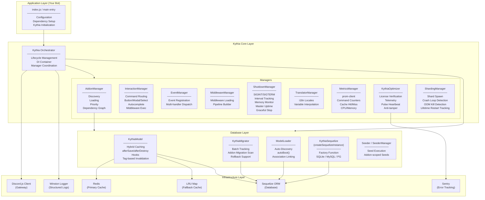

---

## Boot Sequence

The `start()` method follows a strict, ordered initialization sequence:

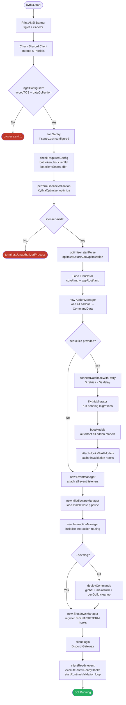

---

## Core Components

### Kythia Orchestrator

**File:** `src/Kythia.ts`

The central class that wires together the entire framework. It acts as the DI container host and startup sequencer.

#### Constructor Parameters

```typescript
new Kythia({
  client: Client;          // ✅ Required — Discord.js Client
  config: KythiaConfig;    // ✅ Required — kythia.config.js object
  logger?: KythiaLogger;   // Optional — defaults to built-in Winston logger
  redis?: Redis;           // Optional — ioredis instance for cache
  sequelize?: Sequelize;   // Optional — Sequelize instance for DB
  models?: object;         // Optional — pre-populated models (populated internally)
  helpers?: object;        // Optional — custom helper functions
  utils?: object;          // Optional — additional utilities
  appRoot?: string;        // Optional — project root (defaults to process.cwd())
})
```

> **Note:** `translator` and `dbDependencies` are **NOT** constructor parameters. `TranslatorManager` is initialized internally. There is no `dbDependencies` property.

#### Public API

| Method | Description |
|---|---|
| `start(): Promise<void>` | Runs the full boot sequence |
| `addDbReadyHook(fn)` | Register callback when DB models are ready |
| `addClientReadyHook(fn)` | Register callback when bot is logged in and ready |
| `registerButtonHandler(id, fn)` | Register button interaction handler |
| `registerModalHandler(prefix, fn)` | Register modal submit handler |
| `registerSelectMenuHandler(prefix, fn)` | Register select menu handler |

#### Key Properties

```typescript
kythia.client      // IKythiaClient (Discord.js Client + container)
kythia.container   // KythiaContainer (all services)
kythia.optimizer   // KythiaOptimizer (license system)
kythia.metricsManager  // MetricsManager (prom-client)
kythia.addonManager    // IAddonManager
kythia.eventManager    // IEventManager
kythia.interactionManager // IInteractionManager
kythia.shutdownManager    // IShutdownManager
kythia.translator         // ITranslatorManager
```

---

### KythiaOptimizer (License System)

**File:** `src/managers/KythiaOptimizer.ts`

Handles license verification, telemetry reporting, and anti-tamper protection. This is an **internal** system — users interact with it via `kythia.config.js` (`licenseKey` field).

#### How It Works

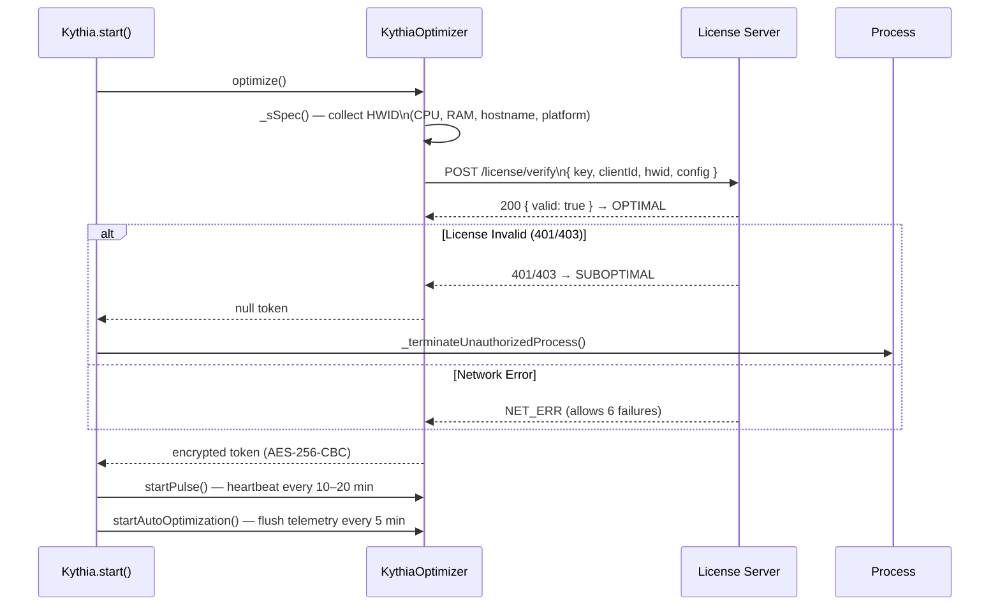

**Telemetry:** Events (startup, errors, crashes) are queued and flushed in batches to the telemetry server. This data is linked to your license key.

---

### AddonManager

**File:** `src/managers/AddonManager.ts`

Manages discovery, loading, and registration of all addons.

#### Addon Loading Flow

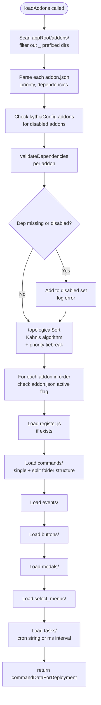

#### Handler Maps

AddonManager maintains these internal `Map`s:

| Map | Key | Description |
|---|---|---|
| `buttonHandlers` | `customId` | Button click handlers |
| `modalHandlers` | `customIdPrefix` | Modal submit handlers |
| `selectMenuHandlers` | `customIdPrefix` | Select menu handlers |
| `autocompleteHandlers` | `commandName` | Autocomplete handlers |
| `taskHandlers` | `taskName` | Cron/interval task references |
| `eventHandlers` | `eventName` | Arrays of event handler functions |
| `embedDrafts` | `key` | Shared embed templates |

#### Intent Validation

AddonManager includes a built-in `EVENT_INTENT_MAP` that validates whether the Discord client has the necessary intents enabled for each registered event handler.

---

### InteractionManager

**File:** `src/managers/InteractionManager.ts`

Routes all `InteractionCreate` events to the appropriate handler and runs the middleware pipeline.

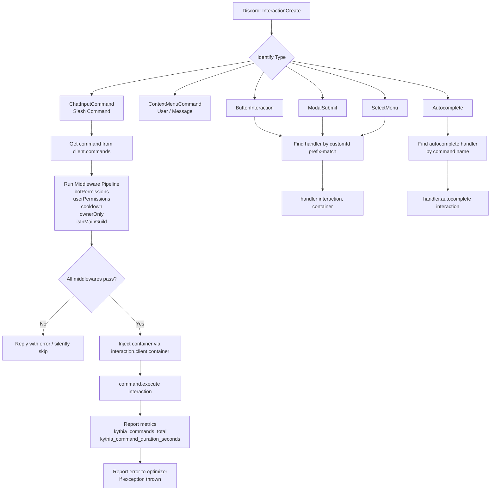

#### Built-in Middleware Properties

| Property | Type | Description |
|---|---|---|
| `botPermissions` | `string[]` | Permissions the bot must have |
| `userPermissions` | `string[]` | Permissions the user must have |
| `cooldown` | `number` (ms) | Per-user cooldown in milliseconds |
| `ownerOnly` | `boolean` | Restrict to `config.bot.ownerId` |
| `isInMainGuild` | `boolean` | Restrict to `config.bot.mainGuildId` |
| `mainGuildOnly` | `boolean` | Deploy command to main guild only |

---

### EventManager

**File:** `src/managers/EventManager.ts`

Routes Discord gateway events to all registered addon event handlers concurrently.

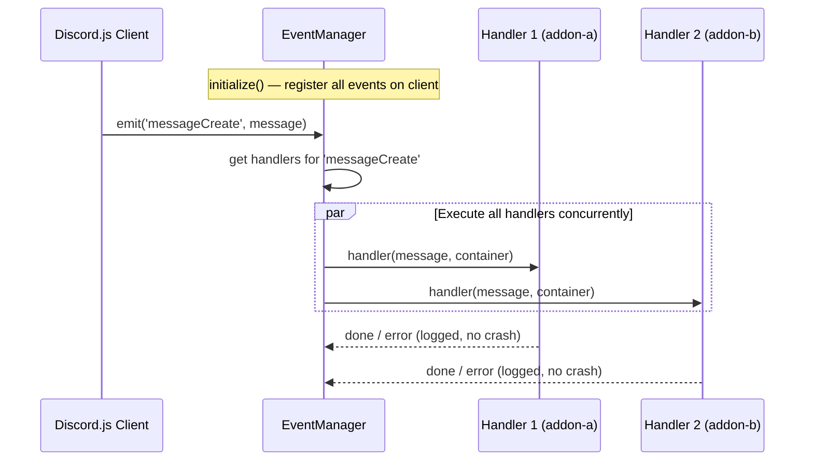

---

### MiddlewareManager

**File:** `src/managers/MiddlewareManager.ts`

Loads additional middleware modules from addons. Called during boot before `InteractionManager` is created.

- Scans addon directories for middleware files
- Provides the middleware pipeline used by `InteractionManager`
- Stored in `container.middlewareManager`

---

### ShutdownManager

**File:** `src/managers/ShutdownManager.ts`

Manages graceful process shutdown and active resource monitoring.

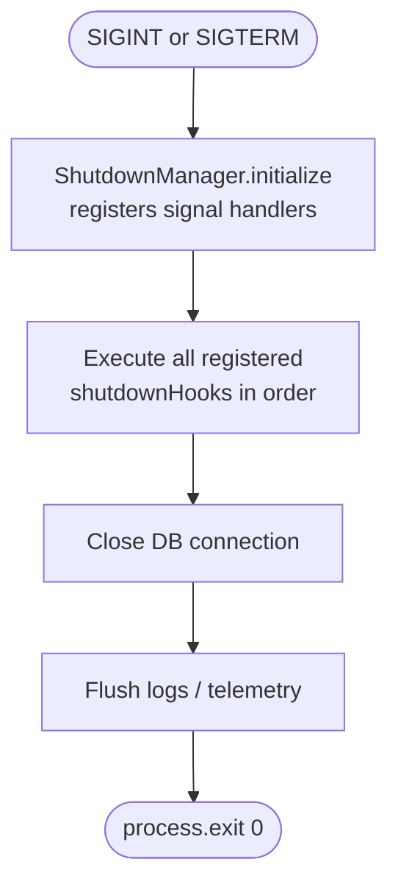

**Features:**
- Patches global `setInterval` / `clearInterval` to track all active intervals
- Automatically clears tracked intervals on shutdown
- Allows addons to register their own cleanup hooks
- **Memory pressure monitor** — polls every 5 minutes; warns at 80% and errors at 95% of the V8 `heap_size_limit` (the actual hard ceiling, not `heapTotal`)
- **Master uptime tracking** — `getMasterUptime()` returns seconds since the master process started, surviving shard restarts

---

### TranslatorManager

**File:** `src/managers/TranslatorManager.ts`

Provides i18n (internationalization) support.

**Loading order during boot:**
1. Core lang files from `src/lang/` (bundled with kythia-core)
2. User lang files from `appRoot/lang/`
3. Addon lang files from `addons/*/lang/` (loaded during addon registration)

**Usage in commands:**
```javascript
async execute(interaction) {
  const { t } = interaction.client.container;
  const message = await t(interaction, 'welcome.message', { user: interaction.user.username });
  await interaction.reply(message);
}
```

The `t` function is bound to `container.t` for convenient access anywhere within the container.

---

### MetricsManager

**File:** `src/managers/MetricsManager.ts`

Exposes Prometheus-compatible performance metrics via `prom-client`. See [METRICS.md](./METRICS.md) for full details.

Available in `container.metrics` (or `kythia.metricsManager`).

---

## Database Layer

### KythiaModel

**File:** `src/database/KythiaModel.ts`

Base Sequelize model class with hybrid caching.

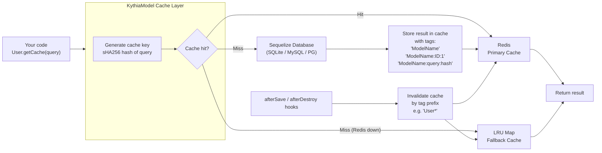

**Static Methods:**

| Method | Description |
|---|---|
| `setDependencies({ logger, config, redis })` | **Must** be called once at startup |
| `autoBoot(sequelize)` | Auto-define model from DB schema (called by ModelLoader) |
| `attachHooksToAllModels(sequelize, client)` | Register cache-invalidation hooks on all models |
| `getCache(query)` | Find one with cache |
| `getAllCache(query)` | Find all with cache |
| `findOrCreateWithCache(options)` | Find or create with cache |
| `countWithCache(options)` | Count with cache |
| `aggregateWithCache(options)` | Aggregate with cache |
| `invalidateCache()` | Manually bust cache for this model |

---

### KythiaMigrator

**File:** `src/database/KythiaMigrator.ts`

Laravel-style migration system powered by `umzug`.

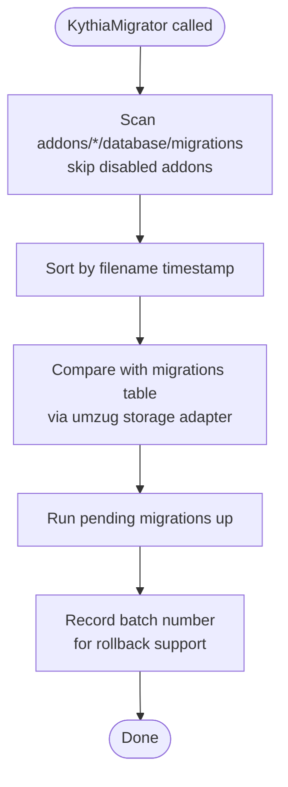

---

### ModelLoader

**File:** `src/database/ModelLoader.ts`

Auto-discovery and booting of all addon Sequelize models.

```
1. Scan addons/*/database/models/
2. Skip disabled addons
3. require() each model file
4. Call Model.autoBoot(sequelize)
5. Register in container.models
6. Execute dbReadyHooks (e.g., define associations)
```

---

### Seeder / SeederManager

**File:** `src/database/Seeder.ts`, `src/database/SeederManager.ts`

Exported from `kythia-core` for use with `npx kythia db:seed`.

```typescript
import { Seeder } from 'kythia-core';

export default class UserSeeder extends Seeder {
  public async run(): Promise<void> {
    const { User } = this.container.models;
    await User.bulkCreate([{ username: 'Admin', role: 'admin' }]);
  }
}
```

---

## Addon System

### Addon Directory Structure

```
addons/my-feature/
├── addon.json              # Metadata & dependency declaration
├── register.js             # Optional: runs once during addon load
├── commands/
│   ├── ping.js             # Simple top-level command
│   └── user/               # Folder = parent command
│       ├── _command.js     # Parent command definition
│       ├── profile.js      # Subcommand
│       └── settings/
│           ├── _group.js   # Subcommand group definition
│           └── privacy.js  # Subcommand in group
├── events/
│   └── messageCreate.js
├── buttons/
│   └── confirm.js
├── modals/
│   └── feedback.js
├── select_menus/
│   └── role-select.js
├── tasks/
│   └── daily-cleanup.js
└── database/
    ├── models/
    │   └── UserData.js
    ├── migrations/
    │   └── 20250128_create_user_data.js
    └── seeders/
        └── UserSeeder.js
```

### addon.json Schema

```json
{
  "name": "my-feature",
  "version": "1.0.0",
  "description": "Feature description",
  "author": "Your Name",
  "priority": 50,
  "dependencies": ["core", "database"],
  "active": true
}
```

| Field | Type | Default | Description |
|---|---|---|---|
| `name` | string | — | Unique addon identifier |
| `version` | string | — | Semantic version |
| `priority` | number | `50` | Load order (0–9999, lower loads first) |
| `dependencies` | string[] | `[]` | Required addon names |
| `active` | boolean | `true` | Enable/disable via addon.json |

Addons can also be disabled project-wide in `kythia.config.js`:
```javascript
addons: {
  'my-feature': { active: false }
}
```

### Dependency Resolution (Kahn's Algorithm)

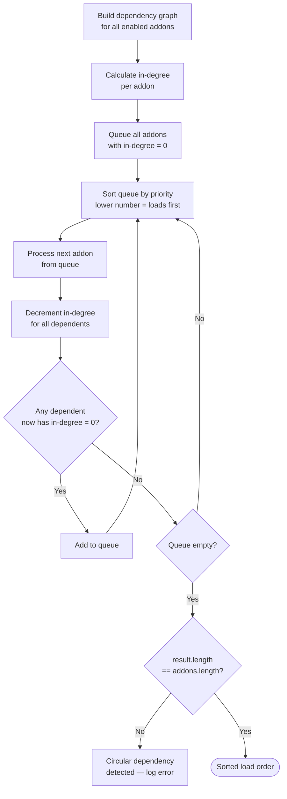

---

## Data Flow Diagrams

### Full Command Execution Flow

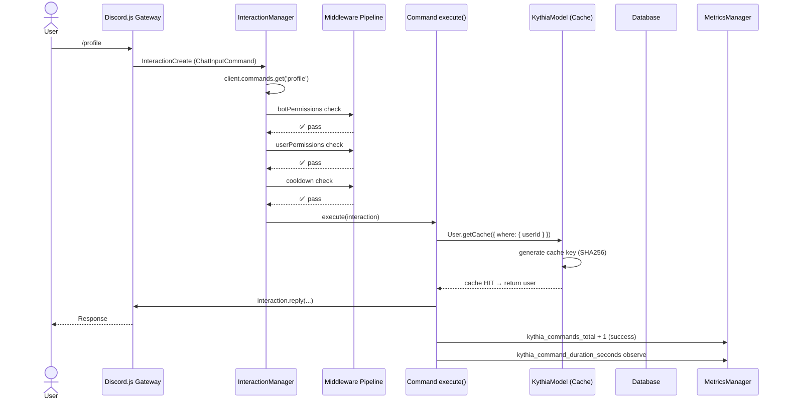

### Database Query with Cache Miss

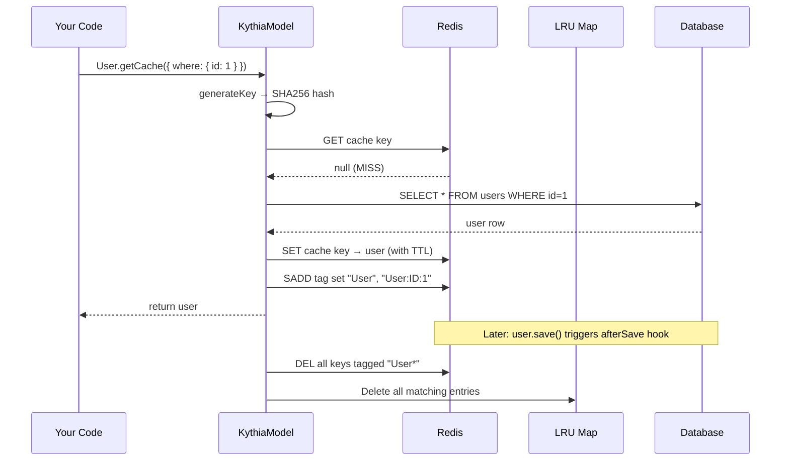

### Event Dispatch Flow

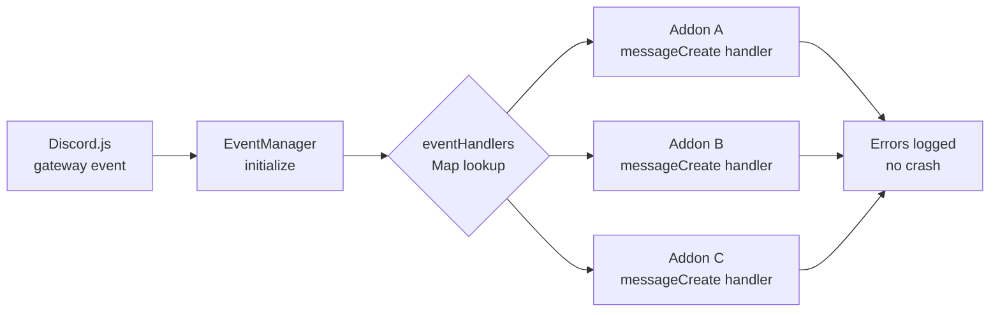

---

## Design Patterns

### 1. Dependency Injection

All services are accessible through `container`, attached to `client.container`. Avoids the need for direct imports from kythia-core in addon code.

```javascript
// ✅ Correct — use DI container
async execute(interaction) {
  const { logger, models, t } = interaction.client.container;
}

// ❌ Incorrect — creates coupling
const logger = require('kythia-core/dist/utils/logger');
```

### 2. Manager Pattern

Each manager owns a single domain. `Kythia.ts` orchestrates them but doesn't implement their logic.

| Manager | Domain |
|---|---|
| `AddonManager` | Addon loading and component registration |
| `InteractionManager` | Discord interaction routing |
| `EventManager` | Discord gateway event routing |
| `MiddlewareManager` | Command middleware pipeline |
| `ShutdownManager` | Process lifecycle and cleanup |
| `TranslatorManager` | i18n and localization |
| `MetricsManager` | Performance observability |
| `KythiaOptimizer` | License verification and telemetry |

### 3. Strategy Pattern (Caching)

`KythiaModel` abstracts the caching backend transparently:

```
Redis available  → use Redis
Redis unavailable → fall back to LRU Map
Developer code → same API either way
```

### 4. Middleware Chain

```javascript
// In your command module object:
module.exports = {
  data: new SlashCommandBuilder().setName('ban'),
  botPermissions: ['BanMembers'],
  userPermissions: ['BanMembers'],
  cooldown: 10000,
  ownerOnly: false,
  async execute(interaction) { /* ... */ }
};
```

### 5. Observer Pattern (Events)

`EventManager` maintains `Map<eventName, handler[]>` — multiple addons can subscribe to the same event independently.

### 6. Factory Pattern

`createSequelizeInstance(config, logger)` encapsulates Sequelize instantiation complexity, supporting SQLite, MySQL, and PostgreSQL from a single unified config.

---

## Scaling Considerations

### Horizontal Scaling

- **Redis for shared cache** — multiple bot shards share the same cache layer
- **Sequelize connection pooling** — configured per DB driver in `kythia.config.js`
- **`ShardingManager` export** — wraps Discord.js `ShardingManager` for multi-process sharding with built-in crash loop prevention and OOM kill detection

### Performance Optimization

- **Hybrid caching** — dramatically reduces DB query load
- **Tag-based invalidation** — surgical cache clearing instead of full flush
- **Batch operations** — `bulkCreate`, `afterBulk*` hooks

### Monitoring

- **KythiaOptimizer** — error telemetry sent to Kythia license server
- **Sentry integration** — application-level error tracking
- **Winston logging** — file + console transport with daily rotation
- **prom-client metrics** — Prometheus-compatible scraping endpoint
- **DiscordWebhookTransport** — `warn` and `error` logs forwarded to a Discord webhook in real-time (attach via `attachWebhookTransport(logger, url, client)`)
- **REST rate limit logging** — `rateLimited` and `invalidRequestWarning` events from the Discord REST manager are captured and forwarded to the webhook transport
- **Memory pressure monitor** — per-shard heap monitoring every 5 minutes (80% warn, 95% error) inside `ShutdownManager`
- **Crash loop alerts** — `ShardingManager` logs a distinctive alert and pauses respawning when a shard dies ≥ 3 times in 5 minutes

---

## Security

| Practice | Implementation |
|---|---|
| Credentials in env | `.env` via `@dotenvx/dotenvx` |
| Permission checks | `botPermissions` / `userPermissions` middleware |
| Rate limiting | `cooldown` middleware per user per command |
| Input validation | Sanitize within `execute()` handlers |
| Error containment | Never expose stack traces in Discord replies |
| License protection | `KythiaOptimizer` with anti-tamper checks |

---

## Conclusion

Kythia Core's architecture is designed for:
- **Scalability** — Redis caching, connection pooling, sharding support
- **Maintainability** — Clean separation via managers and addon isolation
- **Extensibility** — Purely addon-based feature development
- **Reliability** — Retry logic, graceful shutdown, and error containment

For class-level API reference, see [CLASS_REFERENCE.md](./CLASS_REFERENCE.md).  
For CLI tools, see [CLI_REFERENCE.md](./CLI_REFERENCE.md).  
For metrics setup, see [METRICS.md](./METRICS.md).  
For the full `KythiaContainer` property reference, see [CONTAINER.md](./CONTAINER.md).  
For `kythia.config.js` configuration, see [CONFIG.md](./CONFIG.md).  
For the addon authoring guide, see [ADDON_GUIDE.md](./ADDON_GUIDE.md).
