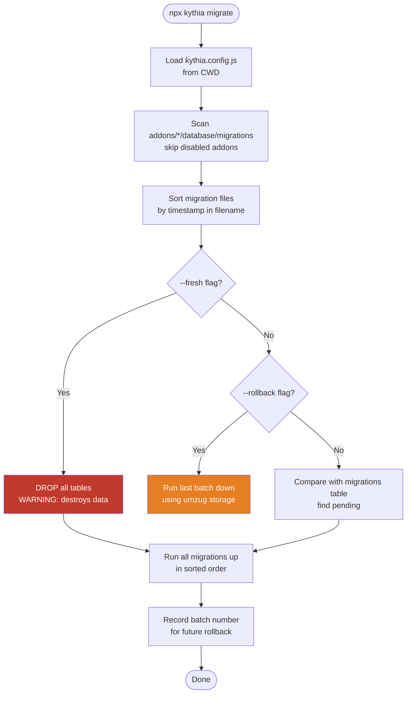
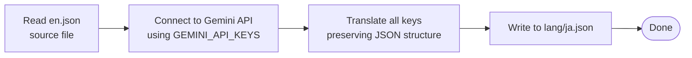

# Kythia Core — CLI Tools Reference

> Complete reference for all command-line tools and utilities — **v0.13.1-beta**

**Related docs:**
- [ADDON_GUIDE.md](./ADDON_GUIDE.md) — Addon authoring guide (includes migration and seeder creation)
- [CONFIG.md](./CONFIG.md) — Full `kythia.config.js` reference
- [CLASS_REFERENCE.md](./CLASS_REFERENCE.md) — Class and method reference

---

## Table of Contents

- [Overview](#overview)
- [Database Commands](#database-commands)
  - [migrate](#migrate)
  - [make:migration](#makemigration)
  - [make:model](#makemodel)
  - [make:seeder](#makeseeder)
  - [db:seed](#dbseed)
  - [cache:clear](#cacheclear)
- [Localization Commands](#localization-commands)
  - [lang:check](#langcheck)
  - [lang:translate](#langtranslate)
  - [lang:sync](#langsync)
- [Development Commands](#development-commands)
  - [docs:generate](#docsgenerate)
  - [di:generate](#digenerate)
  - [dev:namespace](#devnamespace)
  - [gen:structure](#genstructure)
  - [version:up](#versionup)
- [About Command](#about-command)
- [Configuration](#configuration)

---

## Overview

Kythia Core includes a comprehensive CLI toolset, built with `commander` and dynamically loaded from `src/cli/commands/`. The CLI is accessible via:

```bash
npx kythia <command> [options]
```

View all available commands:
```bash
npx kythia --help
```

View version:
```bash
npx kythia --version
```

---

## Database Commands

### migrate

Run pending database migrations.

```bash
npx kythia migrate [options]
```

#### Options

| Flag | Description |
|---|---|
| `-f, --fresh` | **[DESTRUCTIVE]** Drop all tables and re-run all migrations |
| `-r, --rollback` | Rollback the last batch of migrations |

#### Examples

```bash
# Run all pending migrations
npx kythia migrate

# Drop everything and re-run from scratch (DATA LOSS)
npx kythia migrate --fresh

# Rollback the last batch only
npx kythia migrate --rollback
```

#### How It Works



#### Notes

- Migrations are tracked in batches (similar to Laravel's migration system)
- Rollback only affects the **last** batch
- `--fresh` will **destroy all data** — never use in production without a backup

---

### make:migration

Create a new timestamped migration file.

```bash
npx kythia make:migration --name <migration_name> --addon <addon_name>
```

#### Options

| Flag | Required | Description |
|---|---|---|
| `--name <string>` | ✅ | Migration name (snake_case recommended) |
| `--addon <string>` | ✅ | Target addon folder name |

#### Example

```bash
npx kythia make:migration --name create_users_table --addon core
```

#### Output

Creates: `addons/core/database/migrations/20250128120000_create_users_table.js`

```javascript
module.exports = {
  up: async (queryInterface, DataTypes) => {
    await queryInterface.createTable('users', {
      id: {
        type: DataTypes.INTEGER,
        primaryKey: true,
        autoIncrement: true,
      },
      // Add columns here
      createdAt: DataTypes.DATE,
      updatedAt: DataTypes.DATE,
    });
  },

  down: async (queryInterface) => {
    await queryInterface.dropTable('users');
  }
};
```

---

### make:model

Scaffold a new Sequelize model file extending `KythiaModel`.

```bash
npx kythia make:model --name <ModelName> --addon <addon_name>
```

#### Options

| Flag | Required | Description |
|---|---|---|
| `--name <string>` | ✅ | Model class name (PascalCase recommended) |
| `--addon <string>` | ✅ | Target addon folder name |

#### Example

```bash
npx kythia make:model --name User --addon core
```

#### Output

Creates: `addons/core/database/models/User.js`

```javascript
const { KythiaModel } = require('kythia-core');
const { DataTypes } = require('sequelize');

class User extends KythiaModel {
  static tableName = 'users';

  static init(sequelize) {
    return super.init({
      // Define attributes here
      userId: {
        type: DataTypes.STRING,
        unique: true,
      },
    }, {
      sequelize,
      modelName: 'User',
      tableName: this.tableName,
    });
  }
}

module.exports = User;
```

---

### make:seeder

Create a new database seeder file.

```bash
npx kythia make:seeder <name> --addon <addon>
```

#### Options

| Flag | Required | Description |
|---|---|---|
| `--addon <string>` | ✅ | Target addon folder name |

#### Example

```bash
npx kythia make:seeder UserSeeder --addon core
```

#### Output

Creates: `addons/core/database/seeders/UserSeeder.js`

```javascript
const { Seeder } = require('kythia-core');

class UserSeeder extends Seeder {
  async run() {
    const { User } = this.container.models;
    await User.bulkCreate([
      { username: 'Admin', role: 'admin' },
      { username: 'Moderator', role: 'mod' },
    ]);
  }
}

module.exports = UserSeeder;
```

---

### db:seed

Seed the database with records.

```bash
npx kythia db:seed [options]
```

#### Options

| Flag | Description |
|---|---|
| `--class <string>` | Run only a specific seeder class by name |
| `--addon <string>` | Run seeders only from a specific addon |

#### Examples

```bash
# Run all seeders from all addons
npx kythia db:seed

# Run a specific seeder
npx kythia db:seed --class UserSeeder

# Run only seeders from the 'core' addon
npx kythia db:seed --addon core
```

---

### cache:clear

Flush the Redis cache.

```bash
npx kythia cache:clear
```

#### Features

- Supports multiple Redis instances configured via `REDIS_URLS`
- Interactive instance selection if multiple URLs are configured
- Confirms before clearing

#### Example Output

```
🗑️  Redis Cache Clearer
━━━━━━━━━━━━━━━━━━━━━━━━━

? Select Redis instance:
  ❯ Main (redis://localhost:6379)
    Backup (redis://backup:6379)
    All instances

✅ Cache cleared successfully!
```

---

## Localization Commands

### lang:check

Lint translation key usage across the entire codebase (static analysis).

```bash
npx kythia lang:check
```

#### Features

- Uses Babel AST parsing to find all `t('key')` calls
- Reports keys **used in code but missing** from locale JSON files
- Reports keys **in locale JSON but never used** in code
- Scans all `.js` and `.ts` files

#### Example Output

```
📝 Translation Key Checker
━━━━━━━━━━━━━━━━━━━━━━━━━

Scanning files...
✅ Found 150 translation calls

Checking en.json...
❌ Missing keys:
  - welcome.new_user
  - error.invalid_input

⚠️  Unused keys:
  - old.deprecated_key

Summary:
  150 keys used
  2 missing
  1 unused
```

> **Best practice:** Run `lang:check` before every commit using the Husky pre-commit hook.

---

### lang:translate

Auto-translate locale files using Google Gemini AI.

```bash
npx kythia lang:translate --target <language_code>
```

#### Options

| Flag | Default | Description |
|---|---|---|
| `--target <lang>` | `ja` | BCP-47 target language code |

#### Requirements

- `GEMINI_API_KEYS` environment variable set with a valid Gemini API key
- `en.json` must exist as the source file

#### Example

```bash
npx kythia lang:translate --target ja
npx kythia lang:translate --target id
npx kythia lang:translate --target zh
```

#### Process



#### Example Output

```
🌐 Auto-Translator (Gemini AI)
━━━━━━━━━━━━━━━━━━━━━━━━━

Source: en.json (150 keys)
Target: ja (Japanese)

Translating...
✅ welcome.message
✅ error.not_found
...

✅ Translation complete!
Saved to: addons/core/lang/ja.json
```

> **Note:** Always review AI-generated translations before deploying to production.

---

### lang:sync

Synchronize all translation files against the `en.json` master file.

```bash
npx kythia lang:sync
```

#### Features

- Adds missing keys to all language files with `[placeholder]` value
- Removes keys that no longer exist in `en.json`
- Preserves all existing valid translations

#### Example Output

```
🔄 Translation Sync
━━━━━━━━━━━━━━━━━━━━━━━━━

Syncing with en.json (master)...

ja.json:
  + Added 5 new keys
  - Removed 2 unused keys
  ✅ Synced

id.json:
  + Added 5 new keys
  ✅ Synced
```

---

## Development Commands

### docs:generate

Generate markdown documentation for all Discord commands (based on their data structures).

```bash
npx kythia docs:generate [options]
```

#### Options

| Flag | Default | Description |
|---|---|---|
| `-p, --path <path>` | `docs/commands` | Output path for generated docs |

#### Examples

```bash
# Generate to default path (docs/commands/)
npx kythia docs:generate

# Generate to a custom path
npx kythia docs:generate -p src/docs
```

#### Features

- Supports simple commands and split folder command structures
- Generates metadata: permissions, cooldowns, aliases, descriptions
- Resolves module aliases from `package.json`

---

### di:generate

Generate TypeScript type definitions for the Dependency Injection container (helpers and models).

```bash
npx kythia di:generate
```

#### Features

- **Smart Analysis** — Reads `index.js` AST to detect injected helpers
- **Auto Discovery** — Scans filesystem for all Models and Helpers
- **Type Safety** — Generates `types/auto-di.d.ts` for full IntelliSense support

#### Example Output

```
🧙‍♂️ Kythia Type Wizard (Smart Mode)
━━━━━━━━━━━━━━━━━━━━━━━━━

📖 Reading index.js to find injected helpers...
   > Detected keys: color, currency

✨ Done! Generated types matching your index.js dependencies.
```

---

### dev:namespace

Add or update JSDoc `@namespace` and `@file` headers across all source files.

```bash
npx kythia dev:namespace
```

#### Features

- Scans all `.js` and `.ts` files in the project
- Adds JSDoc headers to files that don't have them
- Updates outdated headers
- Maintains consistent file ownership

#### Template

```javascript
/**
 * @file <relative_path>
 * @namespace <addon_name>/<path>
 * @copyright © 2025 kenndeclouv
 * @version 0.12.9-beta
 */
```

#### Example Output

```
📝 Namespace Header Generator
━━━━━━━━━━━━━━━━━━━━━━━━━

Scanning files...
✅ Updated: src/Kythia.ts
✅ Updated: src/managers/AddonManager.ts
⏭️  Skipped: src/utils/index.ts (already exists)

Summary:
  50 files scanned
  35 updated
  15 skipped
```

---

### gen:structure

Generate a markdown project structure tree.

```bash
npx kythia gen:structure
```

#### Output

Creates `temp/structure.md` with the full project directory tree:

```
kythia-core/
├── src/
│   ├── Kythia.ts
│   ├── managers/
│   │   ├── AddonManager.ts
│   │   ├── EventManager.ts
│   │   └── ...
│   └── ...
├── package.json
└── README.md
```

#### Use Cases

- Sharing full project context with AI assistants
- Documentation generation
- Onboarding new contributors

---

### version:up

Sync JSDoc `@version` tags across all source files with the version from `package.json`.

```bash
npx kythia version:up
```

#### Features

- Reads `version` from `package.json`
- Updates all `@version` tags in JSDoc headers
- Ensures consistent versioning across the entire codebase

#### Example

If `package.json` has `"version": "0.12.9-beta"`:

```javascript
/**
 * @version 0.12.9-beta  ← updated automatically
 */
```

#### Example Output

```
🔢 Version Sync
━━━━━━━━━━━━━━━━━━━━━━━━━

package.json version: 0.12.9-beta

Updated files:
✅ src/Kythia.ts (0.12.8 → 0.12.9-beta)
✅ src/managers/AddonManager.ts (0.12.8 → 0.12.9-beta)

Summary:
  50 files updated
```

---

## About Command

View detailed information about the installed Kythia Core package.

```bash
npx kythia about
```

#### Output

```
╔═══════════════════════════════════════════╗
║         🚀 Kythia Core v0.12.9-beta       ║
╚═══════════════════════════════════════════╝

📦 Package Information
   Name:        kythia-core
   Version:     0.12.9-beta
   License:     CC BY NC 4.0
   Author:      kenndeclouv

🏗️  Architecture
   • Addon System
   • Advanced ORM with Hybrid Caching
   • Laravel-style Migrations
   • Task Scheduler (Cron + Interval)
   • Middleware System
   • Dependency Injection
   • License Verification

📚 Documentation
   • README.md
   • ARCHITECTURE.md
   • CLASS_REFERENCE.md
   • CLI_REFERENCE.md

🔗 Links
   • Discord:  https://dsc.gg/kythia
   • GitHub:   https://github.com/kenndeclouv/kythia-core
   • Website:  https://kythia.my.id
   • License:  github.com/kenndeclouv/kythia-core/blob/main/LICENSE
```

---

## Configuration

### Environment Variables

Some CLI commands require environment variables to be present:

```env
# For lang:translate — Google Gemini API key(s)
GEMINI_API_KEYS=your_api_key_here

# For cache:clear with multiple Redis instances
REDIS_URLS=redis://main:6379,redis://backup:6379

# For migrate / db:seed — if not using kythia.config.js
DB_HOST=localhost
DB_PORT=3306
DB_NAME=kythia
DB_USER=root
DB_PASS=password
```

### kythia.config.js

Migration, model, and seeder commands load database configuration from `kythia.config.js` in the current working directory:

```javascript
// kythia.config.js
module.exports = {
  db: {
    driver: 'mysql', // 'sqlite' | 'mysql' | 'postgres'
    name: 'kythia_db',
    host: process.env.DB_HOST,
    port: process.env.DB_PORT,
    user: process.env.DB_USER,
    pass: process.env.DB_PASS,
  },
  // ...other config
};
```

---

## Full Command Reference

| Command | Description |
|---|---|
| `migrate` | Run pending DB migrations |
| `migrate --fresh` | Drop all & re-run all migrations |
| `migrate --rollback` | Rollback last migration batch |
| `make:migration` | Create a new migration file |
| `make:model` | Scaffold a new model file |
| `make:seeder` | Create a new seeder file |
| `db:seed` | Run database seeders |
| `cache:clear` | Flush Redis cache |
| `lang:check` | Lint translation key usage |
| `lang:translate` | AI-translate locale files via Gemini |
| `lang:sync` | Sync all locale files with en.json |
| `docs:generate` | Generate command documentation |
| `di:generate` | Generate DI type definitions |
| `dev:namespace` | Add/update JSDoc namespace headers |
| `gen:structure` | Generate project structure markdown |
| `version:up` | Sync @version tags with package.json |
| `about` | Show package info and links |

---

## Tips & Best Practices

### Migrations

1. **Always create a migration before modifying models**
2. **Test rollback before deploying** — `npx kythia migrate --rollback`
3. **Use descriptive names** — e.g., `add_email_to_users`, `create_guild_settings_table`
4. **One change per migration** — makes rollbacks clean and predictable

### Translations

1. **Run `lang:check` before commits** (or add it to your Husky pre-commit hook)
2. **Use namespaced keys** — e.g., `command.ping.description`, `error.permission_denied`
3. **Keep `en.json` as the master source of truth**
4. **Always review AI-generated translations** before deploying

### Development

1. **Run `version:up` after bumping `package.json` version**
2. **Use `gen:structure`** when sharing project context with AI assistants
3. **Use `di:generate`** after adding new models or helpers to get TypeScript IntelliSense

---

For the full addon authoring guide, see [ADDON_GUIDE.md](./ADDON_GUIDE.md).  
For configuration reference, see [CONFIG.md](./CONFIG.md).
