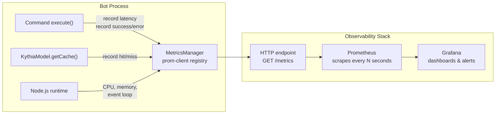
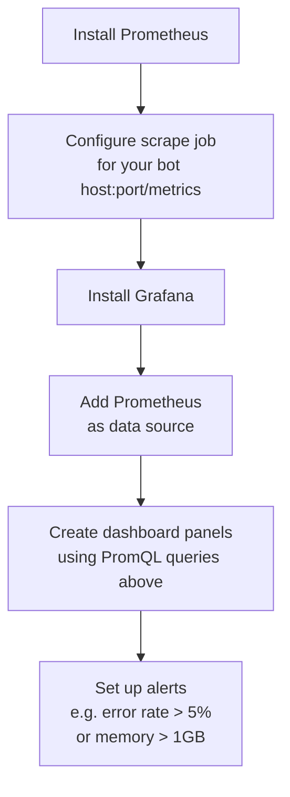

# 📊 Performance Metrics

Kythia Core includes a built-in **Performance Metrics** system powered by [prom-client](https://github.com/siimon/prom-client). This allows you to monitor the health, performance, and usage of your bot in real-time using industry-standard tools like **Prometheus** and **Grafana**.

> **Version:** 0.13.1-beta

---

## Overview

The `MetricsManager` (`src/managers/MetricsManager.ts`) is automatically initialized during `new Kythia(...)` and is available at `container.metrics`. It collects the following metrics:

### 1. Command Execution

- **`kythia_commands_total`** (Counter)
  - Tracks the total number of slash commands executed.
  - **Labels:**
    - `command_name` — name of the command
    - `status` — `success` or `error`

- **`kythia_command_duration_seconds`** (Histogram)
  - Tracks execution time (latency) of slash commands.
  - **Labels:**
    - `command_name` — name of the command

### 2. Cache Performance

- **`kythia_cache_ops_total`** (Counter)
  - Tracks cache hits and misses for `KythiaModel`.
  - **Labels:**
    - `model` — model name (e.g., `User`)
    - `type` — `hit` or `miss`

### 3. System Metrics

Standard Node.js process metrics collected automatically by `prom-client`:

- CPU usage
- Memory usage (Heap used, Heap total, RSS)
- Event loop lag
- Active handles and requests
- Garbage collection statistics

### 4. Memory Pressure Monitor (Built-in)

In addition to prom-client's passive collection, `ShutdownManager` actively monitors heap usage every **5 minutes** per shard:

| Level | Threshold | Log |
|---|---|---|
| `warn` | ≥ 80% of `heap_size_limit` | 🟡 High Memory: X/Y MB heap limit (Z%) \| RSS: N MB |
| `error` | ≥ 95% of `heap_size_limit` | 🔴 CRITICAL Memory: X/Y MB heap limit (Z%) \| RSS: N MB — OOM kill imminent! |

> **Note:** The threshold is compared against `v8.getHeapStatistics().heap_size_limit` — the actual hard ceiling V8 will OOM at (typically 1.5–4 GB on default Node installs). This avoids false alarms from using `heapTotal`, which is dynamic and can be briefly smaller than `heapUsed` during normal heap growth.

---

## Data Flow



---

## 🚀 Accessing Metrics

Metrics are exposed in **Prometheus text format**. Access them via the `MetricsManager` instance in the container.

### Internal Access (debugging)

```typescript
// From within a command or task
const { metrics } = container;

if (metrics) {
  const rawMetrics = await metrics.getMetrics();
  console.log(rawMetrics);
}
```

### Exposing as an HTTP Endpoint (recommended for production)

Set up a separate HTTP server (using `express`, `fastify`, or any framework) that Prometheus can scrape:

```javascript
// In a separate http-server.js file alongside your bot
const express = require('express');
const app = express();

// Reference the Kythia instance from your main bot file
app.get('/metrics', async (req, res) => {
  const { metrics } = kythia.container;

  if (!metrics) {
    return res.status(503).send('Metrics unavailable');
  }

  res.setHeader('Content-Type', metrics.getContentType());
  res.send(await metrics.getMetrics());
});

app.listen(9090, () => {
  console.log('Metrics server running on :9090');
});
```

Then configure Prometheus to scrape `http://your-bot-host:9090/metrics`.

---

## 📈 Visualizing in Grafana

Once Prometheus is scraping your bot, use these PromQL queries to build dashboards:

| Metric | Query | Description |
|---|---|---|
| **Command Rate** | `rate(kythia_commands_total[5m])` | Commands executed per second |
| **Error Rate** | `rate(kythia_commands_total{status="error"}[5m])` | Command errors per second |
| **Cache Hit Ratio** | `sum(rate(kythia_cache_ops_total{type="hit"}[5m])) / sum(rate(kythia_cache_ops_total[5m]))` | Percentage of DB queries avoided by cache |
| **Avg Latency** | `rate(kythia_command_duration_seconds_sum[5m]) / rate(kythia_command_duration_seconds_count[5m])` | Average command execution time |
| **Memory (RSS)** | `process_resident_memory_bytes` | Total resident memory of the process |
| **Heap Used** | `nodejs_heap_size_used_bytes` | JavaScript heap currently in use |
| **Heap Limit** | `nodejs_heap_size_limit_bytes` | V8 hard OOM ceiling (`--max-old-space-size`) |
| **Heap Usage %** | `nodejs_heap_size_used_bytes / nodejs_heap_size_limit_bytes * 100` | True heap pressure percentage |
| **Event Loop Lag** | `nodejs_eventloop_lag_seconds` | Event loop delay (should stay < 100ms) |

---

## ⚙️ Configuration

Metrics are enabled by **default** — `MetricsManager` is initialized in the `Kythia` constructor regardless of configuration. There is no toggle in `kythia.config.js`.

To disable metrics, you would need to modify `Kythia.ts` to remove the `MetricsManager` instantiation (not recommended for production use).

The metrics use `prom-client`'s **default global registry**, ensuring compatibility with standard Prometheus integrations.

---

## Recommended Grafana Dashboard Setup



A minimal `prometheus.yml` scrape config:

```yaml
scrape_configs:
  - job_name: 'kythia-bot'
    static_configs:
      - targets: ['localhost:9090']
    scrape_interval: 15s
```
