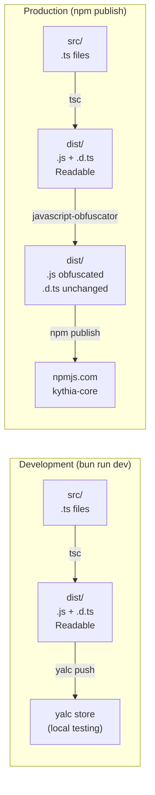

# Production Build with Obfuscation

> **Version:** 0.12.9-beta

## Overview

The package is configured to automatically obfuscate all compiled JavaScript files when publishing to npm. Source code remains clean and readable during local development.

---

## Scripts

### Development

```bash
# Compile TypeScript only (no obfuscation)
bun run build

# Format + build + push to yalc (for local testing with your bot)
bun run dev
```

### Production / Publishing

```bash
# Compile TypeScript + obfuscate all .js files
bun run build:prod

# Automatically runs build:prod before publishing to npm (via prepublishOnly hook)
npm publish
```

---

## Build Pipeline



---

## How It Works

1. **`prepublishOnly` Hook** — Runs automatically before every `npm publish`
2. **`build:prod`** — Compiles TypeScript with `tsc`, then runs the obfuscator on all `.js` files in `dist/`
3. **Obfuscation Settings** — Configured in `obfuscator.config.json` (uses `javascript-obfuscator`)
4. TypeScript type definition files (`.d.ts`) are **never** obfuscated, preserving full IntelliSense for consumers

---

## Protection Features (from `obfuscator.config.json`)

| Feature | Status | Description |
|---|---|---|
| Control Flow Flattening | ✅ Enabled | Makes code flow logic unreadable by flattening if/else into switch blocks |
| Dead Code Injection | ✅ Enabled | Injects unreachable code branches as noise |
| String Array Encoding | ✅ Enabled | Encrypts string literals with base64 encoding |
| Identifier Renaming | ✅ Enabled | Renames all variables and function names to hex (`_0x1a4b`) |
| Self Defending | ✅ Enabled | Detects and breaks code beautification/formatting attempts |
| Number to Expression | ✅ Enabled | Converts numeric literals to complex arithmetic expressions |
| Object Key Transformation | ✅ Enabled | Obfuscates object property access patterns |

---

## Testing Obfuscation Quality

```bash
# 1. Build with obfuscation
bun run build:prod

# 2. Inspect the output
head -n 20 dist/managers/AddonManager.js
```

Obfuscated output should look like:

```javascript
const _0x3f1a=['0x1b2','0x3c4d','split','...'];
(function(_0xab12,_0xcd34){const _0xef56=...
```

You should see:
- ✅ Hexadecimal variable names (`_0x1a4b`, `_0x2cf9`)
- ✅ Encrypted string literals
- ✅ Flattened control flow (switch statements)
- ✅ No comments or readable logic

---

## Package Contents (npm)

When published to npm, the package includes **only**:

```
dist/
├── **/*.js      ← Obfuscated JavaScript
├── **/*.d.ts    ← Type definitions (NOT obfuscated)
└── lang/        ← Translation JSON files (NOT obfuscated)
src/lang/        ← Source lang files
LICENSE
README.md
```

Source files (`src/**/*.ts`) are excluded via `.npmignore`.

---

## Best Practices

**DO:**
- ✅ Use `bun run dev` for local development (fast, unobfuscated)
- ✅ Use `npm publish` for releasing to npm (auto-obfuscates)
- ✅ Test your bot locally with `yalc` before publishing
- ✅ Keep source code clean and readable in Git

**DON'T:**
- ❌ Don't commit obfuscated output files to Git (they are regenerated at publish time)
- ❌ Don't run `build:prod` during development (unnecessary overhead)
- ❌ Don't manually edit obfuscated `dist/` files (your changes will be overwritten)

---

## Upgrading Obfuscation

To upgrade to JavaScript Obfuscator Pro (VM-based protection), which offers stronger guarantees:

1. Obtain an API key from [https://obfuscator.io](https://obfuscator.io)
2. Update `obfuscator.config.json`:

```json
{
  "apiKey": "YOUR_API_KEY",
  "target": "node",
  "compact": true,
  ...
}
```

Pro features include:
- Bytecode virtualization (code runs inside a VM engine)
- Anti-decompilation protection
- Unique VM structure per compilation run
