# Kythia Core — Workflow Diagrams

> Comprehensive visual flow dari seluruh sistem Kythia Core v1.0.0-rc.3

---

## 1. System Architecture Overview

Gambaran besar: dari entry point sampai infrastructure.

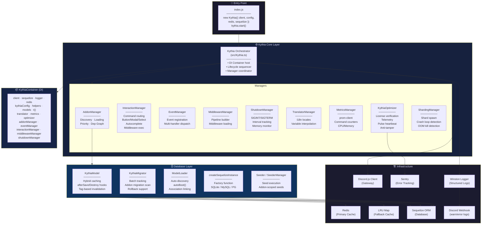

---

## 2. Boot Sequence (kythia.start())

Urutan inisialisasi yang ketat dari awal sampai bot online.

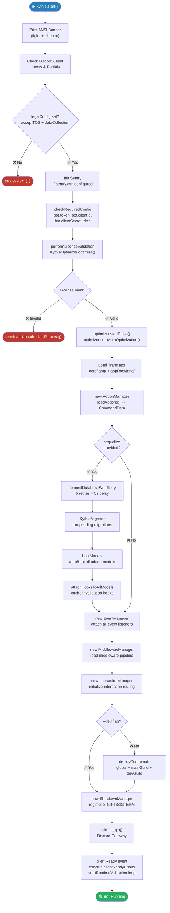

---

## 3. Addon Loading & Dependency Resolution

Dari scan folder sampai urutan load final.

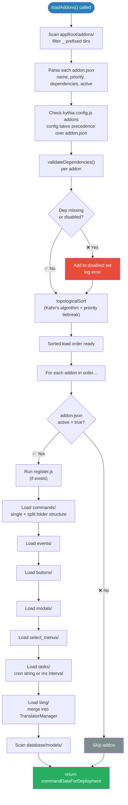

### Kahn's Algorithm (Dependency Resolution Detail)

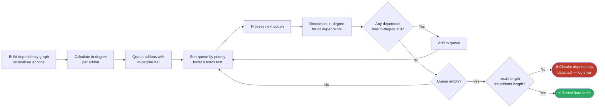

---

## 4. Interaction Routing Pipeline

Dari Discord event masuk sampai command execute & metrics.

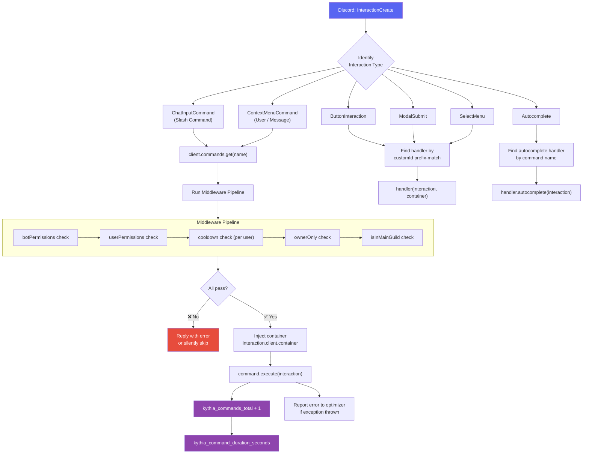

---

## 5. Event Dispatch Flow

Dari gateway event ke semua addon handler yang relevan.

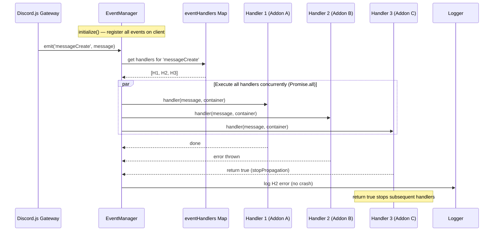

---

## 6. Database & Caching Layer

Query flow dari kode addon ke database, lewat Redis/LRU cache.

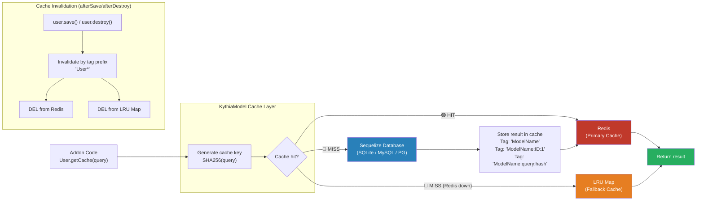

### DB Query: Cache Miss Flow (Detail)

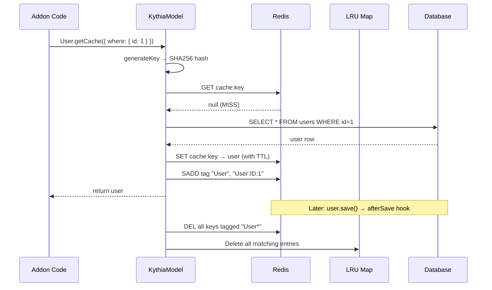

---

## 7. KythiaOptimizer — License & Telemetry Flow

```mermaid
sequenceDiagram
    participant K as Kythia.start()
    participant OPT as KythiaOptimizer
    participant LS as License Server
    participant SENTRY as Sentry
    participant P as Process

    K->>OPT: optimize()
    OPT->>OPT: _sSpec() — collect HWID<br/>(CPU, RAM, hostname, platform)
    OPT->>LS: POST /license/verify<br/>{ key, clientId, hwid, config }

    alt ✅ License Valid (200)
        LS-->>OPT: 200 { valid: true } → OPTIMAL
        OPT-->>K: encrypted token (AES-256-CBC)
        K->>OPT: startPulse() — heartbeat every 10–20 min
        K->>OPT: startAutoOptimization() — flush telemetry every 5 min
        OPT->>SENTRY: report errors/crashes
    else ❌ License Invalid (401/403)
        LS-->>OPT: 401/403 → SUBOPTIMAL
        OPT-->>K: null token
        K->>P: _terminateUnauthorizedProcess()
    else 🔌 Network Error
        LS-->>OPT: NET_ERR
        Note over OPT: Allows up to 6 consecutive failures<br/>before terminating
    end
```

---

## 8. Shutdown Sequence

Dari signal OS sampai process.exit.

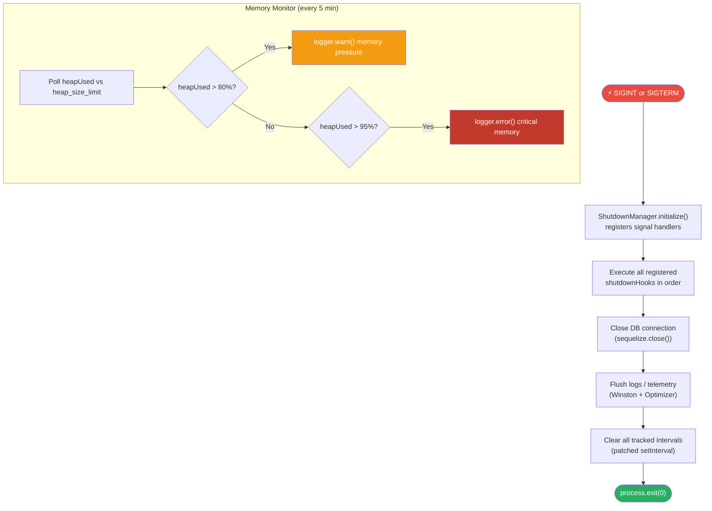

---

## 9. Full Command Execution (End-to-End)

Dari user Discord input sampai response + metrics.

```mermaid
sequenceDiagram
    actor User
    participant DJS as Discord.js Gateway
    participant IM as InteractionManager
    participant MW as Middleware Pipeline
    participant CMD as Command execute()
    participant CM as KythiaModel (Cache)
    participant DB as Database
    participant MM as MetricsManager
    participant OPT as KythiaOptimizer

    User->>DJS: /profile
    DJS->>IM: InteractionCreate (ChatInputCommand)
    IM->>IM: client.commands.get('profile')

    IM->>MW: botPermissions check
    MW-->>IM: ✅ pass
    IM->>MW: userPermissions check
    MW-->>IM: ✅ pass
    IM->>MW: cooldown check
    MW-->>IM: ✅ pass (or ❌ block)

    IM->>CMD: execute(interaction)
    CMD->>CM: User.getCache({ where: { userId } })
    CM->>CM: generate cache key (SHA256)
    CM-->>CMD: cache HIT → return user

    CMD->>DJS: interaction.reply(embed)
    DJS-->>User: ✅ Response shown

    CMD->>MM: kythia_commands_total + 1 (success)
    CMD->>MM: kythia_command_duration_seconds observe

    Note over CMD,OPT: If error thrown during execute():
    CMD->>OPT: reportError(err) → queued telemetry
```

---

## 10. KythiaContainer — Dependency Injection Map

Semua yang ada di dalam container, beserta kapan tersedia.

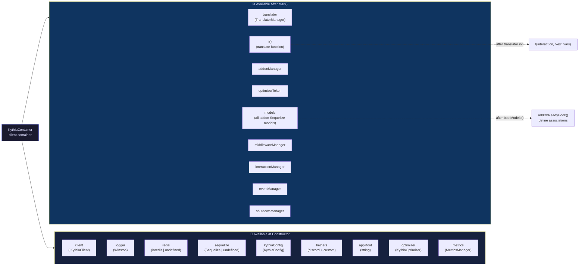

---

## 11. Addon Structure → Auto-Load Mapping

Dari struktur folder ke apa yang di-load Kythia secara otomatis.

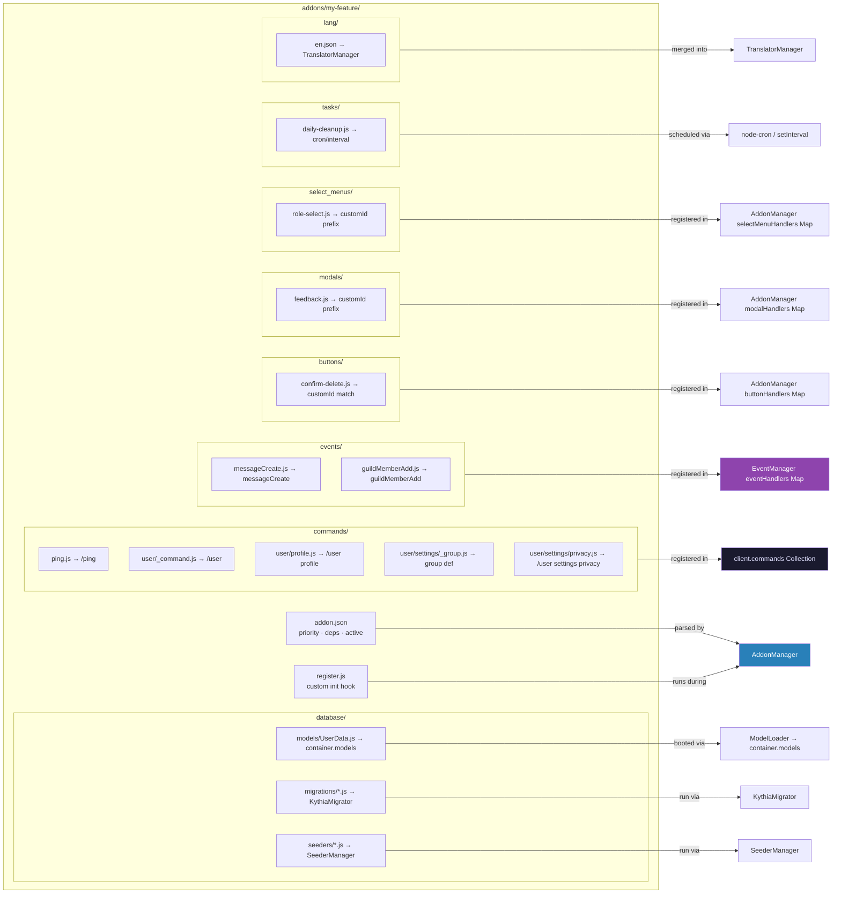

---

## 12. Sharding Architecture (Multi-Process)

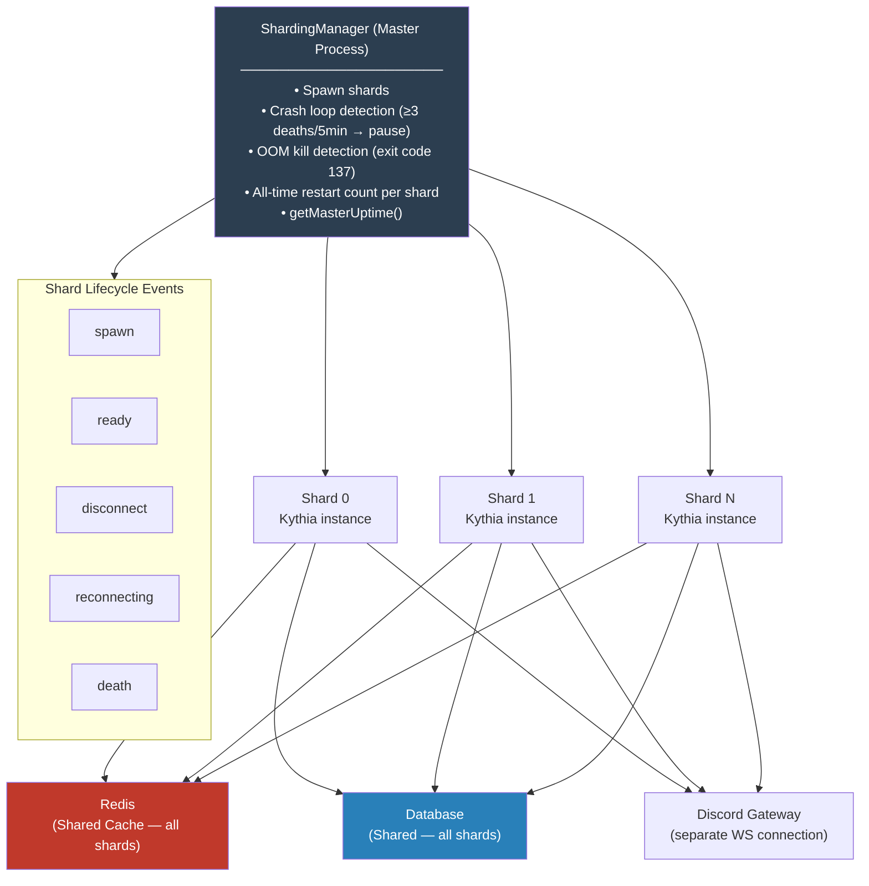

---

## Summary: Data Flow Cheat Sheet

| From | To | Via |
|------|-----|-----|
| `index.js` | `Kythia Orchestrator` | `new Kythia().start()` |
| `Kythia.start()` | All Managers | Sequential initialization |
| `Discord Gateway` | `InteractionManager` | `InteractionCreate` event |
| `InteractionManager` | `Middleware Pipeline` | Before every command |
| `Middleware Pipeline` | `command.execute()` | If all checks pass |
| `command.execute()` | `KythiaContainer` | `interaction.client.container` |
| `KythiaModel.getCache()` | Redis → LRU → DB | Cache fallback chain |
| `afterSave hook` | Redis + LRU | Tag-based invalidation |
| `Discord Gateway` | `EventManager` | Any gateway event |
| `EventManager` | `Addon handlers` | Concurrent `Promise.all` |
| `SIGINT/SIGTERM` | `ShutdownManager` | Signal handlers |
| `ShutdownManager` | `Shutdown hooks → DB close → exit` | Sequential |
| `KythiaOptimizer` | `License Server` | POST /license/verify |
| `KythiaOptimizer` | `Sentry` | Error telemetry |
| `Winston logger` | `Discord Webhook` | warn/error level |
